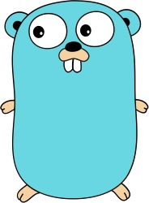

# MJPEG Server

MJPEG Server implements
[MJPEG over HTTP](https://en.wikipedia.org/wiki/Motion_JPEG#M-JPEG_over_HTTP)
using [FFmpeg](https://ffmpeg.org/) or any other input source capable of piping
a multipart JPEG stream to stdout.

Its primary use case is providing screen recordings for remote Webdriver tests,
e.g. for [blueimp/wdio](https://github.com/blueimp/wdio).

It is resource efficient and by default only starts the screen recording process
if there is at least one HTTP client connected to the server, stopping the
recording when there are no more open client connections.

- [Installation](#installation)
- [Usage](#usage)
  - [Options](#options)
  - [Screencast](#screencast)
    - [Linux](#linux)
    - [MacOS](#macos)
    - [Windows](#windows)
- [License](#license)
- [Attributions](#attributions)
- [Author](#author)

## Installation

The MJPEG Server binary can be downloaded for Linux, MacOS and Windows from the
[releases](https://github.com/blueimp/mjpeg-server/releases) page or built from
source via [go get](https://golang.org/cmd/go/):

```sh
go get github.com/blueimp/mjpeg-server
```

The screencast examples also require [FFmpeg](https://ffmpeg.org/) to be
installed.

## Usage

By default, `mjpeg-server` listens on port `9000` on all interfaces and starts
the given recording command when the first HTTP client connects:

```sh
mjpeg-server [options] [--] command [args]
```

The `command` must write a multipart JPEG stream to stdout, e.g.:

```
--ffmpeg
Content-Type: image/jpeg

[IMAGE_DATA]
--ffmpeg
Content-Type: image/jpeg

[IMAGE_DATA]
...
--ffmpeg--
```

A sample multipart JPEG generation program can be tested by running the
following command and opening http://localhost:9000 in your browser:

```sh
go run main.go -a 127.0.0.1:9000 -- go run mpjpeg/main.go -- gopher.jpg
```

It simply streams the provided JPEG images in an endless loop.

### Options

Available MJPEG Server options can be listed the following way:

```sh
mjpeg-server -h
```

```
Usage of mjpeg-server:
  -a string
    	TCP listen address (default ":9000")
  -b string
    	Multipart boundary (default "ffmpeg")
  -d	Start command directly
  -p string
    	URL path (default "/")
  -v	Output version and exit
```

The `-d` option starts the given recording command directly on initialization of
the MJPEG server and keeps it running independently of the number of connected
HTTP clients, until the MJPEG server process is stopped.

### Screencast

#### Linux

Start `mjpeg-server` using the
[x11grab](https://www.ffmpeg.org/ffmpeg-devices.html#x11grab) device, selecting
the X11 display via `-i :DISPLAY` and the matching screen resolution via
`-video_size WIDTHxHEIGHT` option:

```sh
mjpeg-server -- ffmpeg \
  -loglevel fatal \
  -probesize 32 \
  -fpsprobesize 0 \
  -analyzeduration 0 \
  -fflags nobuffer \
  -f x11grab \
  -r 15 \
  -video_size 1440x900 \
  -i :0 \
  -f mpjpeg \
  -q 2 \
  -
```

#### MacOS

List the available
[avfoundation](https://www.ffmpeg.org/ffmpeg-devices.html#avfoundation) input
devices:

```sh
ffmpeg -f avfoundation -list_devices true -i -
```

Start `mjpeg-server`, selecting the capture device via `-i INDEX` option:

```sh
mjpeg-server -- ffmpeg \
  -loglevel error \
  -probesize 32 \
  -fpsprobesize 0 \
  -analyzeduration 0 \
  -fflags nobuffer \
  -f avfoundation \
  -capture_cursor 1 \
  -r 15 \
  -pixel_format yuyv422 \
  -i 1 \
  -f mpjpeg \
  -q 2 \
  -
```

#### Windows

On Windows, we can use the built-in
[gdigrab](https://ffmpeg.org/ffmpeg-devices.html#gdigrab) input device to
capture the whole desktop.

Start `MJPEGServer` using the following command in a Powershell console:

```posh
MJPEGServer -- ffmpeg `
  -loglevel error `
  -probesize 32 `
  -fpsprobesize 0 `
  -analyzeduration 0 `
  -fflags nobuffer `
  -f gdigrab `
  -r 15 `
  -i desktop `
  -f mpjpeg `
  -q 2 `
  -
```

## License

Released under the [MIT license](https://opensource.org/licenses/MIT).

## Attributions

The [Gopher](gopher.jpg) image used for the tests was designed by
[Renee French](https://reneefrench.blogspot.com/).  
The design is licensed under the
[Creative Commons 3.0 Attributions license](https://creativecommons.org/licenses/by/3.0/).



## Author

[Sebastian Tschan](https://blueimp.net/)
